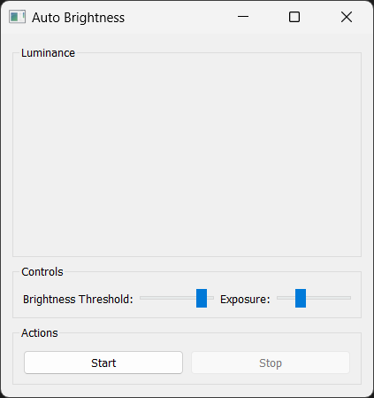
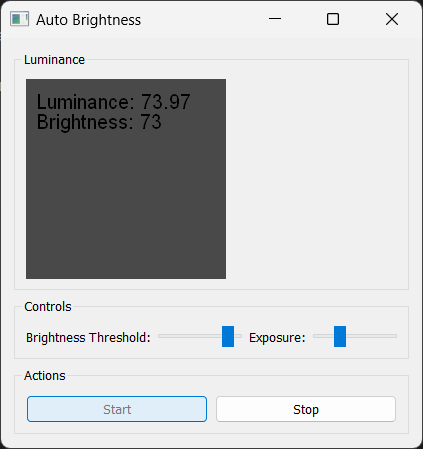

# Auto Brightness Application

This is an Auto Brightness application developed using PyQt5, OpenCV, and WMI. The application captures the luminance from the webcam feed and adjusts the screen brightness accordingly.




## Features

- Adjusts screen brightness based on the luminance from the webcam feed.
- Provides controls to set the brightness threshold and exposure.
- Minimizes to the system tray and allows showing/hiding the main window.
- Start and stop the webcam feed with buttons.

## Project Structure

```
auto_brightness/
│
├── main.py
├── requirements.txt
├── README.md
├── screenshots/
│   ├── image-1.png
│   └── image.png
└── src/
    ├── __init__.py
    ├── app.py
    ├── tray_icon_manager.py
    ├── webcam_controller.py
    └── ui.py

```

- `main.py`: The entry point of the application.
- `src/app.py`: Contains the `AutoBrightnessApp` class which sets up the user interface, integrates the system tray icon, and handles the webcam operations.
- `src/tray_icon_manager.py`: Manages the system tray icon and its context menu.
- `src/webcam_controller.py`: Handles the webcam operations and brightness adjustments.
- `src/ui.py`: Provides functions to create the UI components (luminance display and control sliders).
- `requirements.txt`: Lists the dependencies required for the project.

## Installation

1. Clone the repository:

```bash
git clone https://github.com/yourusername/auto_brightness.git
cd auto_brightness
```

2. Create a virtual environment and activate it:

```bash
python -m venv venv
source venv/bin/activate   # On Windows use `venv\Scripts\activate` or you can also use conda
```

3. Install the dependencies:

```bash
pip install -r requirements.txt
```

4. Place your icon file (e.g., `icon.png`) in the root directory of the project.

## Running the Application

To run the application, execute the following command:

```bash
python main.py
```

## Usage

- Use the sliders to adjust the brightness threshold and exposure.
- Click the "Start" button to start the webcam feed and automatically adjust the screen brightness.
- Click the "Stop" button to stop the webcam feed.
- The application minimizes to the system tray. You can show or hide the main window by double-clicking the tray icon.

## Building the Executable

To build the executable using PyInstaller, follow these steps:

Install PyInstaller:

```bash
pip install pyinstaller
```

Create the executable:

```bash
pyinstaller --name AutoBrightness --onefile --windowed --icon=icon.ico main.py
```

- The --name option specifies the name of the executable.
- The --onefile option bundles everything into a single executable.
- The --windowed option prevents a console window from appearing when you run the application (useful for GUI applications).
- The --icon option specifies the icon file for the application.

Locate the Executable:
After the build process completes, you will find the executable file in the dist directory inside your project folder.

## License

This project is licensed under the MIT License. See the [LICENSE](LICENSE) file for details.

## Acknowledgements

- PyQt5
- OpenCV
- WMI
