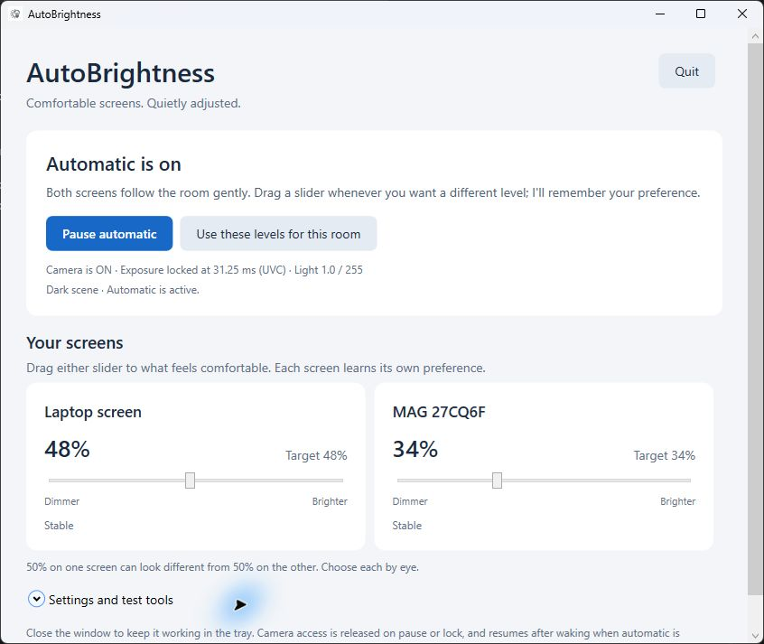
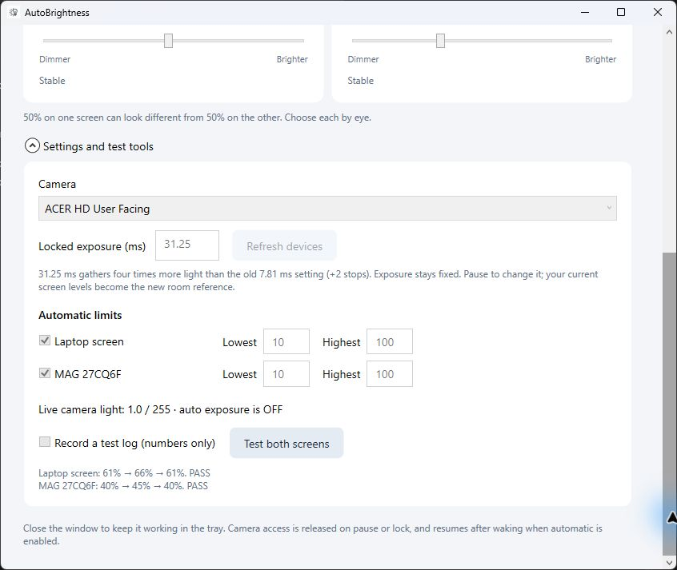

# AutoBrightness for Windows

One webcam adjusts your laptop screen and supported external monitors together. The Windows app is built in C# with .NET 10 and runs in the system tray, with a separate comfortable brightness level for each display.

**[Download the latest Windows x64 release](https://github.com/rishavnathpati/Autobrightness/releases/latest)** · [Detailed setup and hardware support](windows/README.md) · [Release notes](docs/releases/v2.3.0.md)

## Get started

1. Download **AutoBrightness-v2.3.0-win-x64.zip** from the release page and extract it.
2. Open **AutoBrightness.exe**. Python and a separate .NET installation are not required.
3. Leave the webcam uncovered and choose a comfortable level for each screen.
4. Click **Turn on automatic** to use those levels as your reference for the current room lighting.
5. Close the window to keep it running in the tray. **Pause automatic** releases the webcam; **Quit** exits.

Requires Windows 10 version 2004 or later, an x64 PC, a webcam that exposes manual exposure control, and a supported display brightness interface. Enable camera access in Windows if it is blocked. Pause automatic brightness before using another app that needs the webcam.

## Screenshots

### Automatic brightness

Each display has its own slider and target. Moving a slider teaches that screen a new preference. Equal percentages do not imply equal physical brightness.



### Settings and hardware tests

Choose the camera, fixed exposure and automatic limits. The screen test briefly changes each supported display, reads back its brightness and restores it. Pause automatic mode to edit camera settings or limits.



These are screenshots of the running Windows app. Brightness values and camera readings reflect the particular test session; the images do not establish calibrated room illuminance.

## What it does

- **Controls both kinds of display.** Laptop panels use WMI; compatible external monitors use DDC/CI over supported HDMI, DisplayPort or USB-C display connections.
- **Keeps exposure fixed.** Automatic exposure is disabled and verified. The default 31.25 ms is four times the previous ACER webcam exposure of 7.81 ms (+2 stops).
- **Meters 25 regions.** A median of regional measurements reduces the influence of localized bright objects and shadows. Temporal filtering and a noise deadband reduce flicker.
- **Moves smoothly.** Small, frequent brightness steps target roughly 1–3 second transitions. Brightening is slightly faster than dimming; actual monitor latency varies.
- **Learns each screen separately.** Slider adjustments and confirmed native brightness changes update that display's reference. Automatic limits default to 10–100%; manual sliders offer 0–100% where supported.
- **Treats darkness as normal.** Black frames keep automatic mode active. Missing frames or a lost exposure lock are reported as camera failures.
- **Keeps processing local.** Camera frames remain in memory. The app saves no webcam images or audio and has no network client. Optional test logs contain numbers only.

## Hardware and current limitations

DDC/CI must be enabled on the external monitor. Docks, adapters, KVMs, display drivers and some picture/HDR modes may prevent brightness control. A USB-C connector alone does not guarantee support. Unsupported displays are shown with a reason.

A webcam measures image brightness, not lux. Screen reflections, large foreground changes, camera gain and image processing can affect it even with exposure locked. This app does not match screen luminance in nits. Higher exposure improves light collection but cannot recover a scene with no light and can clip bright rooms.

**Known observation in v2.3.0:** the ACER test webcam returned near-black frames at 31.25 ms during part of testing, then later reported about 118/255 without restarting or changing exposure. Automatic mode stayed active and both displays reacted. Physical room lighting was not controlled, so the cause of the earlier black signal and improved low-light sensitivity are not established. A visibly lit room returning black still needs camera/driver investigation.

Sleep, session unlock and display reconnection recovery are implemented but need longer hardware evaluation. Battery impact has not been measured. Launch at Windows sign-in is not installed automatically.

## Validation

- **33 deterministic tests pass**, covering image metering, dark scenes, foreground objects, filtering, transitions, independent displays, manual preferences, delayed readback, failures and settings migration.
- Real WMI and DDC/CI tests passed on a laptop panel and an MSI MAG 27CQ6F, including brightness changes, readback and restoration.
- The real EXE was exercised through its Windows UI. Fixed exposure was confirmed through the camera driver.

See the [test report](docs/TEST-REPORT-v2.3.0.md) for evidence and the distinction between simulated lighting tests and actual optical testing.

## Build from source

Install the .NET 10 SDK on Windows, then run:

```powershell
git clone https://github.com/rishavnathpati/Autobrightness.git
cd Autobrightness
dotnet build windows/AutoBrightness.slnx -c Release
dotnet run --project windows/AutoBrightness.Tests -c Release --no-build
dotnet run --project windows/AutoBrightness.App -c Release
```

For standalone publishing, diagnostics, settings locations and design details, see [windows/README.md](windows/README.md).

| Directory | Purpose |
| --- | --- |
| `windows/AutoBrightness.App` | WPF interface, tray, camera capture, WMI and DDC/CI |
| `windows/AutoBrightness.Core` | Light metering, filtering, curves and brightness coordination |
| `windows/AutoBrightness.Tests` | Deterministic regression tests with simulated hardware |
| `docs` | Test evidence, release notes and legacy instructions |
| `src` | Original Python implementation |

GitHub Actions builds and tests changes and packages the Windows app. A push to `master` whose commit subject starts with `release: v` publishes the version from the app project after checks pass, using `docs/releases/v<version>.md`. Other commits and pull requests only build and test. Existing release tags are never overwritten. See the [workflow](.github/workflows/build.yaml).

## Original Python app

The Python code remains in `src/` and `main.py` for reference. Its historical setup is in [Legacy Python documentation](docs/legacy-python.md); those instructions do not apply to the C# executable.
